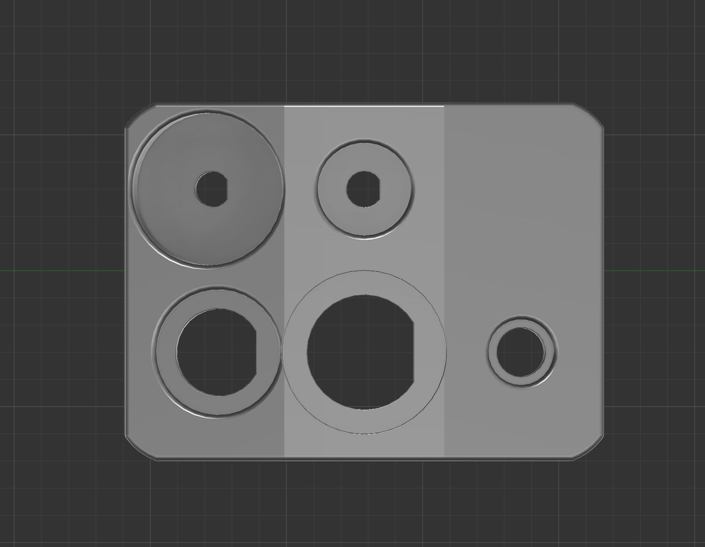

# OpenChubNET Enclosure

## Overview
This enclosure is designed for OpenMANET field nodes and integrates a Pi 4B with an internal battery-backed UPS.

## Philosophy

- A large enough case to fit the bulkiest SBC + UPS + Hat configuration. Room on one side of the case to pass through thin USB to power and USB eth.
- A mounting board that the SBC sits on which slides into the case, it has holes to pass through cables. The board translates different SBC + UPS + Hat configurations to fit the case
- Multiple top lids with various antenna configurations depending on antenna types, number of antennas, Power over USB, EUD eth over USB, buttons etc.

## Order of build

1. Print files 
2. Mount the Pi4B and Waveshare UPS D to the printed mounting plate. Use the Waveshare UPS D flat head screws
3. Add the Li-ion battery and wiring
5. Assemble connectors to lid
6. Connect antennas
7. Connect USB cables to hardware
8. Install and test OpenMANET as per [instructions](https://openmanet.github.io/docs/initial-setup.html)

Assembly images can be found at https://www.instagram.com/p/DSH5yTLCO6E

## Parts List

### Baseline
- 1 x Raspberry Pi 4B
- 1 x [Waveshare UPS HAT D](https://www.waveshare.com/ups-hat-d.htm)
- 2 x 21700 3.7V rechargeable lion batteries

### Connectors
- 2 x [CAZN USB-C waterproof port](https://www.aliexpress.us/item/3256806032665821.html)
- 1 x [CAZN RJ45 waterproof](https://www.aliexpress.com/item/1005006207254042.html)
- (alternative) 1 x [CAZN RJ45 waterproof 180 degrees](https://www.aliexpress.com/item/1005006207174223.html)

### Antenna cables
- 1 x [NType to UFL RG178 20cm](https://www.aliexpress.com/item/1005008877279360.html)
- 1 x [SMA to UFL 20cm](https://www.aliexpress.com/item/1005005697399884.html)

### Antennas
- 1 x [Gizont 915MHz gooseneck NType](https://www.aliexpress.com/item/1005006433957349.html)
- 1 x [Gizont GPS Stubby](https://www.aliexpress.com/item/1005006022171372.html)

## Options

### Antenna cables

I went with NType and thicker RG178 cables, but TNC or SMA options are available at resellers.

### Antennas

Gooseneck, whips, spring flexible. Check out Gizont store on Aliexpress

### Aliexpress resellers

- [Gizont Factory Store](https://www.aliexpress.com/store/1103206200)
- [CAZN Factory Store](https://www.aliexpress.com/store/1103206200)

## Print instructions

### Case

Print standing up. No supports needed

- [Case](stl/openMANET_enclosure_rpi4_ups_battery_rj45.stl)

### Mounting plate

Print laying down. No supports needed

- [Board](stl/openMANET_mounting_plate.stl)

### Top

Print laying down or at 45 degree for fewer supports. Supports needed.

- [usbc rj45 ntype sma](stl/openMANET_top_usbc_rj45_ntype_sma.stl)
- [usbc rj45 sma sma](stl/openMANET_top_usbc_rj45_sma_sma.stl)
- [usbc rj45 sma sma power](stl/openMANET_top_usbc_rj45_sma_sma_power.stl)

## DIY top lids

There is a [top lid stencil](stl/openMANET_stencil_top.stl) which can be use to punch out holes to your liking

Additionally there are punches for 

- [CAZN RJ45](stl/openMANET_stencil_cazn_rj45.stl)
- [CAZN USB](stl/openMANET_stencil_cazn_usb.stl)
- [NType](stl/openMANET_stencil_ntype.stl)
- [SMA Large](stl/openMANET_stencil_sma_large.stl)
- [SMA Small](stl/openMANET_stencil_sma_small.stl)

In Fusion 360 add the stencils to the top, combine, cut. 

## Bambu Labs project

- [OpenChubnet slim](stl/OpenChubnet_slim.3mf)

## Reference images

